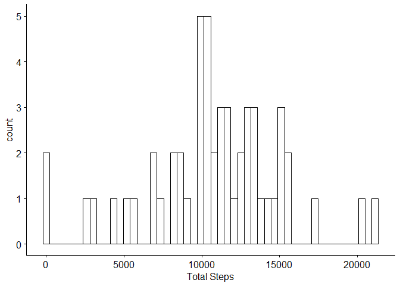
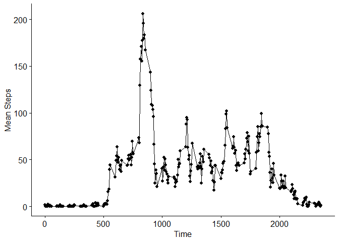
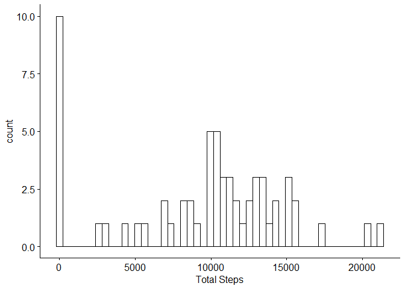
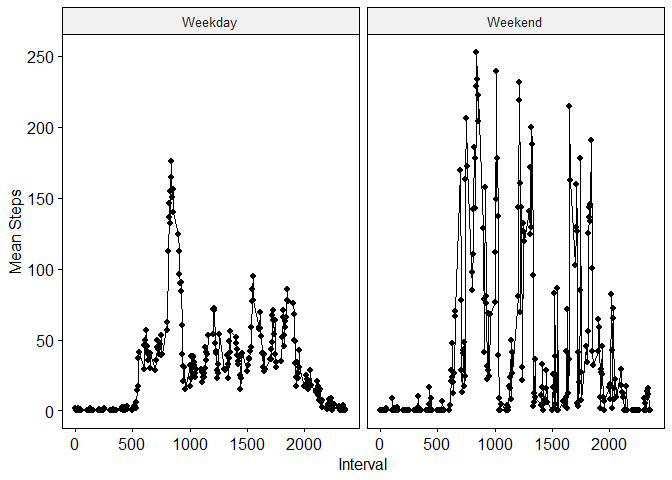

## Loading and preprocessing the data
We will use the tidyverse package to read and process the data.
We will use ggpubr for plotting.  

```
## -- Attaching packages --------------------------------------- tidyverse 1.3.0 --
```

```
## v ggplot2 3.3.3     v purrr   0.3.4
## v tibble  3.0.4     v dplyr   1.0.2
## v tidyr   1.1.2     v stringr 1.4.0
## v readr   1.4.0     v forcats 0.5.0
```

```
## -- Conflicts ------------------------------------------ tidyverse_conflicts() --
## x dplyr::filter() masks stats::filter()
## x dplyr::lag()    masks stats::lag()
```

```
## 
## -- Column specification --------------------------------------------------------
## cols(
##   steps = col_double(),
##   date = col_date(format = ""),
##   interval = col_double()
## )
```
Let's inspect and get some idea of what the data looks like. 

```r
head(data)
```

```
## # A tibble: 6 x 3
##   steps date       interval
##   <dbl> <date>        <dbl>
## 1    NA 2012-10-01        0
## 2    NA 2012-10-01        5
## 3    NA 2012-10-01       10
## 4    NA 2012-10-01       15
## 5    NA 2012-10-01       20
## 6    NA 2012-10-01       25
```

```r
summary(data)
```

```
##      steps             date               interval     
##  Min.   :  0.00   Min.   :2012-10-01   Min.   :   0.0  
##  1st Qu.:  0.00   1st Qu.:2012-10-16   1st Qu.: 588.8  
##  Median :  0.00   Median :2012-10-31   Median :1177.5  
##  Mean   : 37.38   Mean   :2012-10-31   Mean   :1177.5  
##  3rd Qu.: 12.00   3rd Qu.:2012-11-15   3rd Qu.:1766.2  
##  Max.   :806.00   Max.   :2012-11-30   Max.   :2355.0  
##  NA's   :2304
```

## What is mean total number of steps taken per day?
We will ignore the NAs in this section. 
We can group the data by date and calculate the mean & median total number of steps taken per day. 

```r
totalperday<-data %>%
  group_by(date) %>%
  summarize(`Total Steps`=sum(steps)) %>%
  rename(Date=date)
```

```
## `summarise()` ungrouping output (override with `.groups` argument)
```

```r
totalperday
```

```
## # A tibble: 61 x 2
##    Date       `Total Steps`
##    <date>             <dbl>
##  1 2012-10-01            NA
##  2 2012-10-02           126
##  3 2012-10-03         11352
##  4 2012-10-04         12116
##  5 2012-10-05         13294
##  6 2012-10-06         15420
##  7 2012-10-07         11015
##  8 2012-10-08            NA
##  9 2012-10-09         12811
## 10 2012-10-10          9900
## # ... with 51 more rows
```
Calculate mean and median values. 

```r
meanandmedian<-totalperday %>%
  summarize(Mean=mean(`Total Steps`, na.rm=TRUE), Median=median(`Total Steps`, na.rm=TRUE))
meanandmedian
```

```
## # A tibble: 1 x 2
##     Mean Median
##    <dbl>  <dbl>
## 1 10766.  10765
```

Plot a histogram to visualize the total number of steps taken each day.

```r
gghistogram(totalperday, x="Total Steps", bins=50)
```

```
## Warning: Removed 8 rows containing non-finite values (stat_bin).
```

<!-- -->

## What is the average daily activity pattern?
We first compute the average number of steps taken across all days for each 5-minute interval.

```r
timeseries<-data %>%
  group_by(interval) %>%
  summarise(`Mean Steps`=mean(steps, na.rm=TRUE)) %>%
  rename(Time=interval)
```

```
## `summarise()` ungrouping output (override with `.groups` argument)
```

```r
timeseries
```

```
## # A tibble: 288 x 2
##     Time `Mean Steps`
##    <dbl>        <dbl>
##  1     0       1.72  
##  2     5       0.340 
##  3    10       0.132 
##  4    15       0.151 
##  5    20       0.0755
##  6    25       2.09  
##  7    30       0.528 
##  8    35       0.868 
##  9    40       0     
## 10    45       1.47  
## # ... with 278 more rows
```
Now we make a time series plot of the 5-minute interval and average number of steps taken, averaged across all days.

```r
ggline(timeseries, x="Time", y="Mean Steps", numeric.x.axis=TRUE)
```

<!-- -->

The maximum number of steps seem to occur at approximately 0800. 
Lets check the exact interval.


```r
timeseries[which.max(timeseries$`Mean Steps`),]
```

```
## # A tibble: 1 x 2
##    Time `Mean Steps`
##   <dbl>        <dbl>
## 1   835         206.
```
## Imputing missing values
Check the number of missing values in the dataset.

```r
sum(is.na(data))
```

```
## [1] 2304
```
Replace missing values with 0 for that 5-minute interval. 

```r
data_replacedNA<-data %>%
  replace(is.na(.), 0)
```

Re-plot histogram to see any changes.

```r
totalperday_replacedNA<-data_replacedNA %>%
  group_by(date) %>%
  summarize(`Total Steps`=sum(steps)) %>%
  rename(Date=date)
```

```
## `summarise()` ungrouping output (override with `.groups` argument)
```

```r
gghistogram(totalperday_replacedNA, x="Total Steps", bins=50)
```

<!-- -->

Calculate mean and median values. 

```r
meanandmedian_replacedNA<-totalperday_replacedNA %>%
  summarize(Mean=mean(`Total Steps`, na.rm=TRUE), Median=median(`Total Steps`, na.rm=TRUE))
meanandmedian_replacedNA
```

```
## # A tibble: 1 x 2
##    Mean Median
##   <dbl>  <dbl>
## 1 9354.  10395
```
Both the mean and median have decreased due to the replacement of NAs with 0s. 
Imputing missing data on the estimates may cause the estimates to shift, depending on what they were replaced by and thus we have to consider the values that we replace the NAs with. 

## Are there differences in activity patterns between weekdays and weekends?
Add a factor weekdays to the dataset.

```r
library(lubridate)
```

```
## 
## Attaching package: 'lubridate'
```

```
## The following objects are masked from 'package:base':
## 
##     date, intersect, setdiff, union
```

```r
weekdays<-data_replacedNA %>%
  mutate(Day=day(as.POSIXct(date))) %>%
  mutate(WeekDayEnd=as.factor(ifelse(Day==6|Day==7, "Weekend", "Weekday")))
weekdays
```

```
## # A tibble: 17,568 x 5
##    steps date       interval   Day WeekDayEnd
##    <dbl> <date>        <dbl> <int> <fct>     
##  1     0 2012-10-01        0     1 Weekday   
##  2     0 2012-10-01        5     1 Weekday   
##  3     0 2012-10-01       10     1 Weekday   
##  4     0 2012-10-01       15     1 Weekday   
##  5     0 2012-10-01       20     1 Weekday   
##  6     0 2012-10-01       25     1 Weekday   
##  7     0 2012-10-01       30     1 Weekday   
##  8     0 2012-10-01       35     1 Weekday   
##  9     0 2012-10-01       40     1 Weekday   
## 10     0 2012-10-01       45     1 Weekday   
## # ... with 17,558 more rows
```
Get the total number of steps for Weekdays and Weekends and create a line plot to visualise the difference.

```r
weekdays_total<-weekdays %>%
  select(!Day) %>%
  group_by(WeekDayEnd, interval) %>%
  summarise(mean(steps)) %>%
  rename(Interval=interval, `Mean Steps`=`mean(steps)`)
```

```
## `summarise()` regrouping output by 'WeekDayEnd' (override with `.groups` argument)
```

```r
ggline(weekdays_total, x="Interval", y="Mean Steps", facet.by="WeekDayEnd", numeric.x.axis=TRUE)
```

<!-- -->

Here we observe that on weekdays, there's a clear peak in the morning hours. For weekends, the distribution is rather uniform. 
